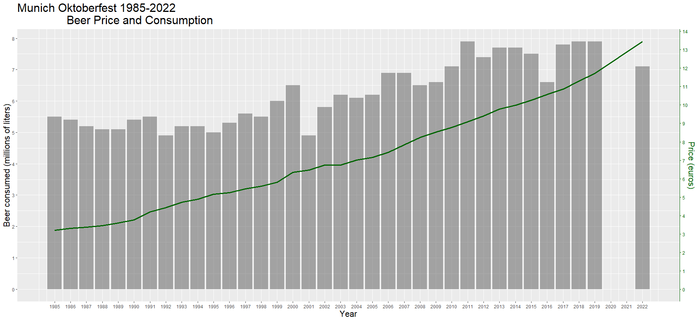
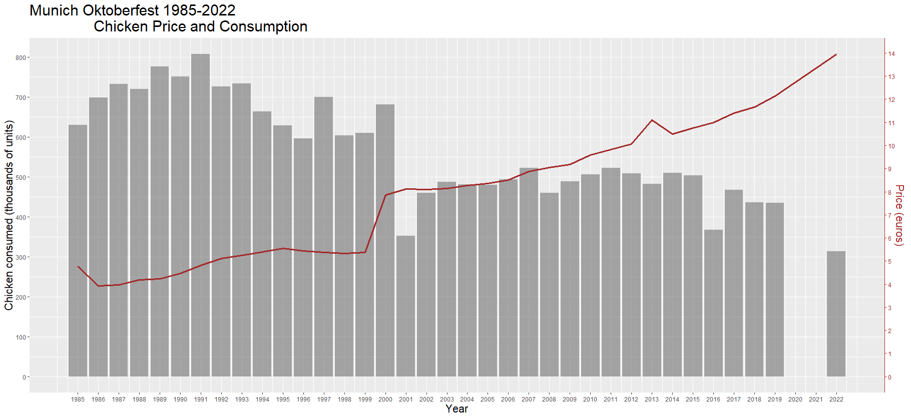
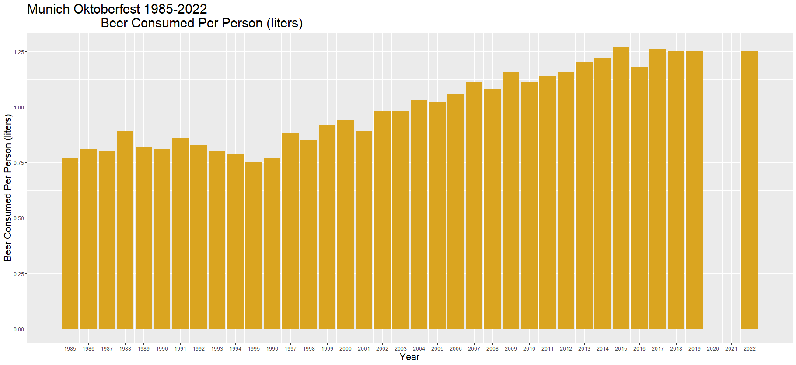
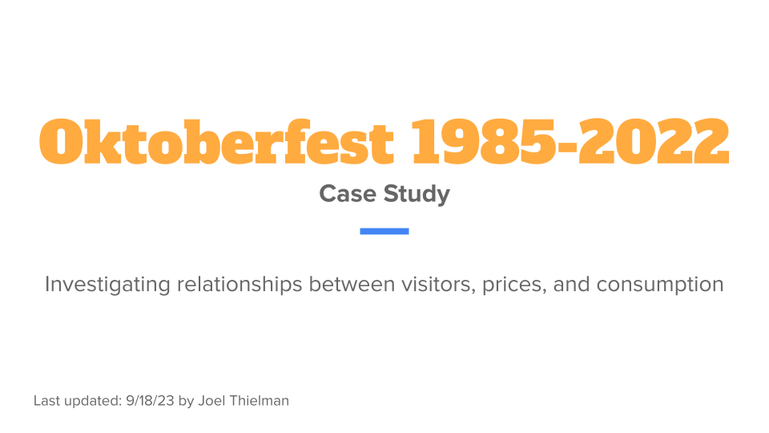
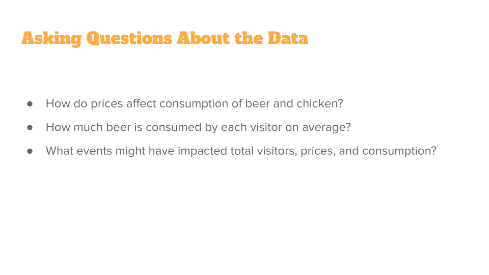
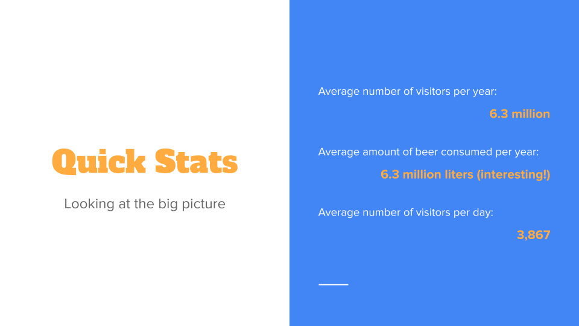
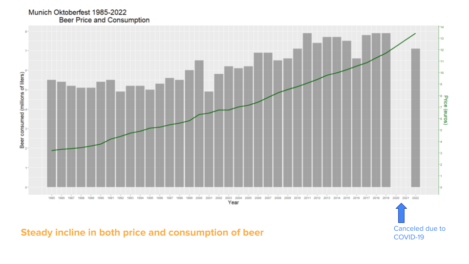
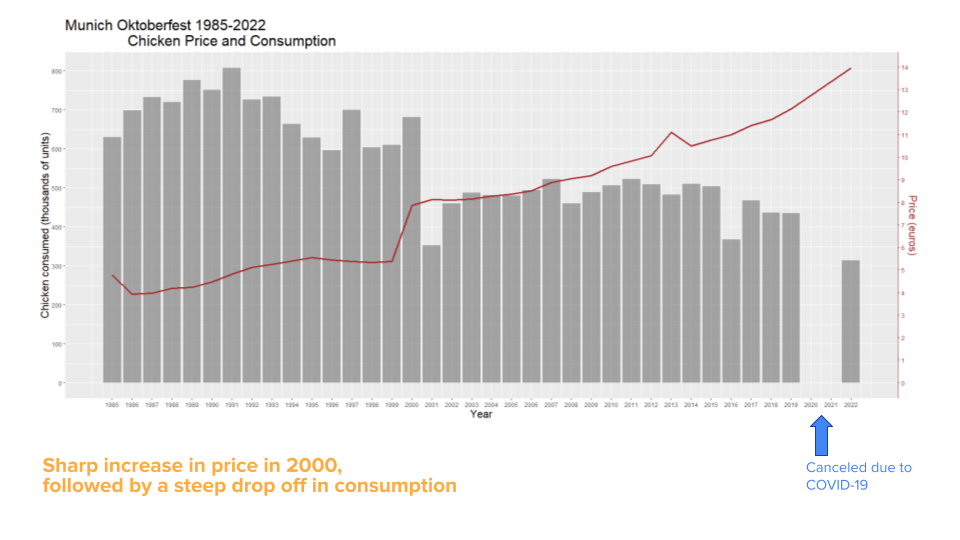
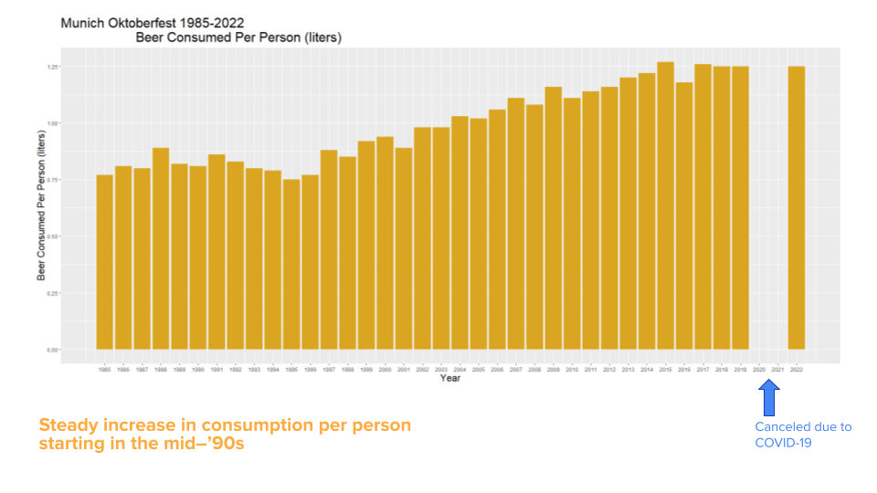
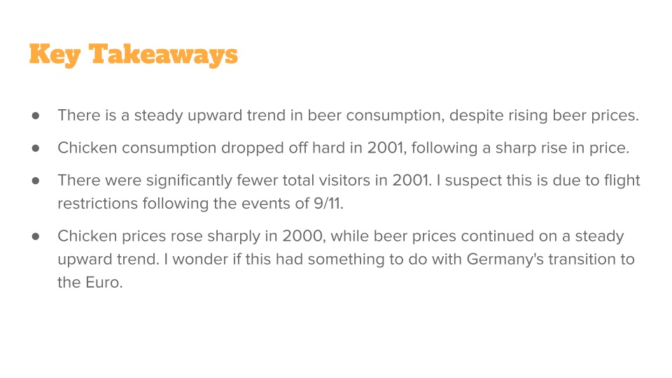

# Oktoberfest R Case Study


This analysis is for Case Study #33 developed by Fabian Werkmeister and uses public datasets downloaded [here.](https://opendata.muenchen.de/dataset/oktoberfest)
<br>I chose to use RStudio and Microsoft Excel for analysis and visualization.</br>
<br>(Note: data is missing from 2020 and 2021 due to the COVID-19 pandemic.)</br>

# STEP 1: IMPORT DATA

Upload Oktoberfest dataset (csv file):
```
df = read.csv("oktoberfest_in_total_1985_2022_clean.csv")
```

# STEP 2: CLEAN AND ORGANIZE DATA

For this step, I used Excel to: 
<br>
- translate column names from German to English
- convert values to the same scale
- change columns to the correct datatype
- add a column for beer consumed per person

# STEP 3: CONDUCT DESCRIPTIVE ANALYSIS

Descriptive analysis on total_visitors_millions:
```
summary(df$total_visitors_millions)
```

Inspect beer price and chicken price over the years:
```
df %>%
  select(year, beer_price_euros, chicken_price_euros)
```

Inspect beer consumption and chicken consumption over the years:
```
df %>%
  select(year, beer_consumed_liters_millions, chicken_consumed_units_thousands)
```

Visualize beer price vs beer consumption over the years:
```
# Set variables so we can have two different y-axes
ylim.prim = c(0:800)
ylim.sec = c(0, 14)

scaleFactor = max(df$beer_consumed_liters_millions) / max(df$beer_price_euros)
scaleFactor2 = max(df$chicken_consumed_units_thousands) / max(df$chicken_price_euros)

ggplot(df, aes(year)) +
  geom_col(aes(y = beer_consumed_liters_millions), alpha = 0.5) +
  geom_line(aes(y = beer_price_euros * scaleFactor), color = "darkgreen", linewidth = 1.2) +
  scale_y_continuous(breaks = 0:8, name = "Beer consumed (millions of liters)",
        sec.axis = sec_axis(~./scaleFactor, breaks = 0:14, name = "Price (euros)")) +
  scale_x_continuous(name = "Year", breaks = 1985:2022) +
  theme(axis.line.y.right = element_line(color = "darkgreen"), 
        axis.ticks.y.right = element_line(color = "darkgreen"),
        axis.text.y.right = element_text(color = "darkgreen"), 
        axis.title.y.right = element_text(color = "darkgreen", size = 48/.pt),
        axis.title.y.left = element_text(size = 48/.pt),
        axis.title.x = element_text(size = 48/.pt),
        plot.title = element_text(size = 64/.pt)) +
        ggtitle("Munich Oktoberfest 1985-2022
                Beer Price and Consumption")
```



Visualize chicken price vs chicken consumption over the years:
```
ggplot(df, aes(year)) +
  geom_col(aes(y = chicken_consumed_units_thousands), alpha = 0.5) +
  geom_line(aes(y = chicken_price_euros * scaleFactor2), color = "brown", linewidth = 1.2) +
  scale_y_continuous(breaks = c(0,100,200,300,400,500,600,700,800), name = "Chicken consumed (thousands of units)",
        sec.axis = sec_axis(~./scaleFactor2, breaks = 0:14, name = "Price (euros)")) +
  scale_x_continuous("Year", breaks = 1985:2022) +
  theme(axis.line.y.right = element_line(color = "brown"), 
        axis.ticks.y.right = element_line(color = "brown"),
        axis.text.y.right = element_text(color = "brown"), 
        axis.title.y.right = element_text(color = "brown", size = 48/.pt),
        axis.title.y.left = element_text(size = 48/.pt),
        axis.title.x = element_text(size = 48/.pt),
        plot.title = element_text(size = 64/.pt)) +
        ggtitle("Munich Oktoberfest 1985-2022
                Chicken Price and Consumption")
```



Visualize average amount of beer (in liters) consumed per person over the years:
```
ggplot(df, aes(x = year, y = beer_consumed_per_person_liters)) +
        geom_col(fill = "goldenrod") +
        labs(title = "Munich Oktoberfest 1985-2022
                     Beer Consumed Per Person (liters)",
              y = "Beer Consumed Per Person (liters)",
              x = "Year") +
        scale_y_continuous(breaks = c(0,0.25,0.5,0.75,1,1.25,1.5)) +
        scale_x_continuous(breaks = c(1985:2022)) +
        theme(plot.title = element_text(size = 64/.pt),
              axis.title.x = element_text(size = 48/.pt),
              axis.title.y = element_text(size = 48/.pt))
```



# STEP 4: KEY TAKEAWAYS

My key takeaways from this analysis are:
<br>
- There is a steady upward trend in beer consumption, despite rising beer prices.
- Chicken consumption dropped off hard in 2001, following a sharp rise in price.
- There were significantly fewer total visitors in 2001. I suspect this is due to flight restrictions following the events of 9/11.
- Chicken prices rose sharply in 2000, while beer prices continued on a steady upward trend. I wonder if this had something to do with Germany's transition to the Euro.

# STEP 5: PRESENT KEY FINDINGS TO STAKEHOLDERS








